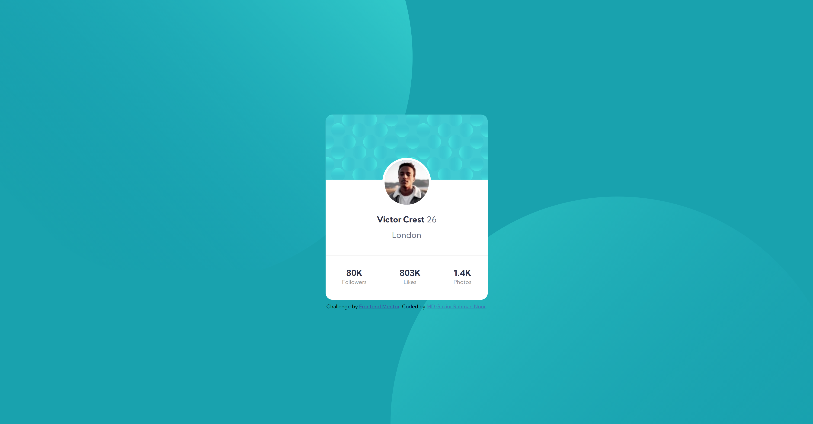
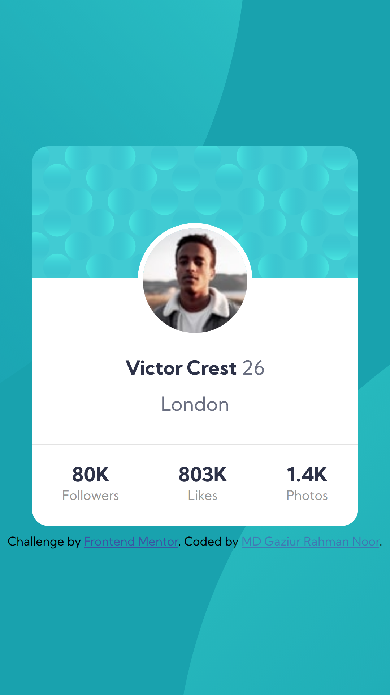

# Frontend Mentor - Profile card component solution

This is a solution to the [Profile card component challenge on Frontend Mentor](https://www.frontendmentor.io/challenges/profile-card-component-cfArpWshJ). Frontend Mentor challenges help you improve your coding skills by building realistic projects.

## Table of contents

- [Frontend Mentor - Profile card component solution](#frontend-mentor---profile-card-component-solution)
  - [Table of contents](#table-of-contents)
  - [Overview](#overview)
    - [The challenge](#the-challenge)
    - [Screenshot](#screenshot)
    - [Links](#links)
  - [My process](#my-process)
    - [Built with](#built-with)
    - [What I learned](#what-i-learned)
  - [Author](#author)

**Note: Delete this note and update the table of contents based on what sections you keep.**

## Overview

### The challenge

- Build out the project to the designs provided

### Screenshot

### Links

- Solution URL: [Github Repo](https://github.com/mdgaziur/frontend-mentor-profile-card)
- Live Site URL: [Live Site](https://mdgaziur.github.io/frontend-mentor-profile-card)

## My process

### Built with

- CSS
- HTML
- Flexbox

### What I learned

nothing :)

## Author

- Website - [Portfolio](https://mdgaziur.github.io)
- Frontend Mentor - [@mdgaziur](https://www.frontendmentor.io/profile/mdgaziur)
- Twitter - [@mdgaziurrahman7](https://www.twitter.com/mdgaziurrahman7)
